# Read & Review

This is Read & review it is a fullstack project. The website is for people who enjoy reading and who love to share and to get the thougths of recently read books. Or to just discover books that you have not read yet. you can post reviews on the website , and connect with others on the site!
Its made with React and Django REST, and bootstrap.
[Read & Review here!](https://read-and-review-bdeebdc26c44.herokuapp.com/)

## Read & Review - - Table Content

- [Planning the project](#Planning)
- [Wireframes](#wireframes)
- [Agile methodology](#Agile-methodology)
- [Website Features](#Features)
- [To be features](#to-be-features)
- [backend](#django-rest)
- [Installed Libraries](#installed-libraries)
- [Technical Stack](#technical-stack)
- [Testing](#testing)
- [Validation](#validation)
- [Testing in React](#testing-in-react)
- [Bugs](#bugs)
- [Deployment](#deployment)
- [Credits](#credits)
- [Acknowledgements](#acknowledgements)

# Planning

### User stories om github

User story stack

 

- Here is all the user storys made for this project. from the django rest back end to React front end planning.

[User story github](https://github.com/users/Timalexanderandersson/projects/11)

## Wireframes

Here is all the wireframe created for desktop and mobil format.
except for profiles. which is not included in this project yet.
and the rating system, since i did not have the time before deadline.

## Mobile

Here is the wirefram for mobile.

- here user can see new posts on the page and intro for the webpage.

Front page.

 

- sign in for user with password and username.

Sign in.

 

- Registration for user with input for password and username.

Registration.

 

- inside post/sign in, user can comment on post, and delete, comment.
- made with component in react.

Inside post sign in.

 

- visitor can not comment on the post.

Inside post logged out.

 

- here the visitor/user can find new uploaded posts.

explore-page.

 

- user can edit the post.

Edit post.

 

- user can post a review on to the website.

Add post

 

- Dropdown for user to find links in navigation field.

dropdown

 

## Desktop

- here user can see new posts on the page and intro for the webpage.

front page

 

- here the visitor/user can find new uploaded posts.

explore-new

 

- user can post a review on to the website.

Add post

 

- user can edit the post.

Edit post

 

- sign in for user with password and username.

Sign in

 

- Registration for user with input for password and username.

Registration

 

- inside post/sign in, user can comment on post, and delete, comment.
- made with component in react.

Inside post

 

- visitor can not comment on the post.

post not sign in 

 

# Agile methodology

Was using Agile methodology while working on the project Read & Review. which worked good, following the user storys and checking them of one by one. making sure they was living up to acceptance criteria.

#### the 3 steps in the user story.

#### To Do

When the user story is created.

#### In Progress

When the user story is in progress to get done.

#### Done

When the user story is done.

### Diagram for models

Diagram models comment 

 

Diagram models post 

 

- lucid.app to create the diagrams

# Features

### navbar

- in the navbar if logged in(explore-page, add-review, signout, homepage )
- if sign out (sign in, explore-page, register, and homepage. )

navbar desktop

 

mobile navbar

 

### Footer

- In the footer you have links and a text for following our pages on social media. (instagram, youtube, facebook)

footer mobil/desktop

 

### Contact page

- This page contains a form if visitor/user want to contact the owner of the page.
- Need to fill in the name, email, and alternativ in a dropdown, and then a description about it.

Contact desktop

 
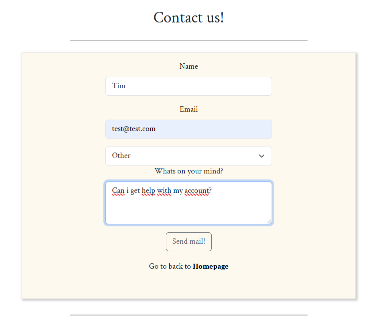

Mobile Contact

 
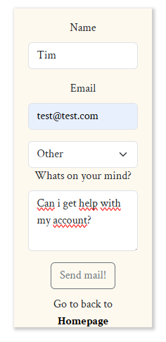

### frontpage

- Frontpage include a list of 4 of the new add reviews posts. and short intro for the webpage.

Frontpage desktop

 

mobile frontpage

 

### add-review and edit.

- add-review includes (title, description, and image-upload, and button for creating the post)
- edit include the samethings and contains the information since created.

add review desktop/mobil

 

### posts page and comment.

- post shows all the information the user put out. and give users a comment section for commenting.

post desktop/mobil sign in

 

post desktop/mobil sign out

 

### explore page.

- contains all the new post with short description on all.

explore desktop/mobil 

 

### Register.

- Register for user so they can get access to the website.

 desktop/mobil 

 

### Sign in.

- sign in for user who already have an account.

 desktop/mobil 

 

# To be features

- planning on making a profile page with an bio for information.
- and rating system with stars.
- and be able to comment on others comments.

# Django Rest backend

[Django rest API](https://github.com/Timalexanderandersson/Read-review-Django-API)

[heroku live](https://read-review-django-api-b8922a0fef0a.herokuapp.com/)

# Installed Libraries

**@testing-library/dom**

**testing-library/jest-dom**

**testing-library/react**

**testing-library/user-event**

**types/react-dom**

**types/react**

**axios**

**bootstrap**

**jest**

**jwt-decode**

**msw**

**nsw**

**react-bootstrap**

**react-dom**

**react-router-dom**

**react-scripts**

**react**

**util**

**web-vitals**

 ## devDependencies (Testing)
  
  **babel/core**

  **@babel/plugin-proposal-private-property-in-object**

  **@babel/plugin-syntax-jsx**

  **@babel/preset-env**

  **@babel/preset-react**

  **@babel/preset-typescript**

  **@testing-library/dom**

  **@testing-library/jest-dom**

  **@testing-library/react**

  **@types/react**

  **@types/react-dom**

  **babel-jest**
  
  **jest**

  **msw**

  **nsw**

# Technical Stack

- React: framework for frontend.
- CSS: style the site.
- Bootstrap.js: style the website.
- Gitpod: development
- Git: version control
- Heroku: for deploying front-end.

# Testing

### Lighthouse

#### Desktop Lighthouse testing

Desktop results

 
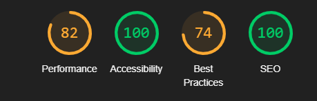

#### Mobile Lighthouse

Mobile results

 

## Validation

- W3C validator shows.
  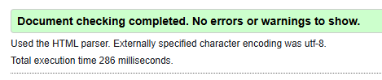

- W3C jigsaw.
  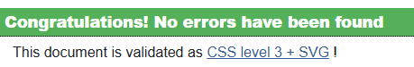

- JSHint on all pages.
  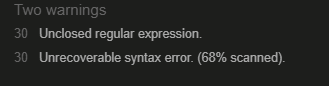

- CI python Linter
- tested in all serializers and views.
  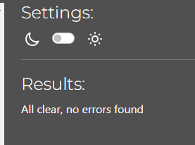

## Testing in React.

| Status  | **Delete post - Post deleted getting 204 status in Editpostpage.test.js**                            |
| :-----: | :----------------------------------------------------- |
| &check; | Deleted post (status code 204). |

| Status  | **Registration status - When registrated getting 201 status in Signup.test.js**                           |
| :-----: | :------------------------------------------------------------- |
| &check; | Registration submit getting (status 201).|

| Status  | **Navbar - When User not Sign in. NavBar.test.js**                           |
| :-----: | :------------------------------------------------------------- |
| &check; | User not sign in(Home, Explore now, Sign in, Register, Contact).

| Status  | **Navbar - When Sign in. NavBar.test.js**                           |
| :-----: | :------------------------------------------------------------- |
| &check; | User Sign in (Home, Explore now, Sign out, Add review, Contact).

| Status  | **Create post - button is there in the add review Editpostpage.test.js**                                     |
| :-----: | :----------------------------------------------------------- |
| &check; | The "Create post" button on Editpostpage.test.js |

## Bugs

#### No bugs found inside the project.

### unsolved bugs

#### None.

## Deployment

### Create project repository github

Log in to **GitHub** then navigate to **Code institute template** for making the project. 

[Code institute template ](https://github.com/Code-Institute-Org/ci-full-template).

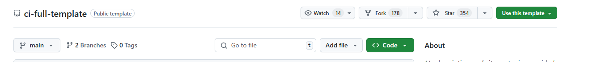

Click on the **"Use this template"** on rigth side of the page, and then press the **"Create a new repository"**

Creating a descriptive project name in the **"Repository name"** field. In the Public/Private section choose Public.
Then click **"Create Repository"**.

### Create heroku app

Login to the **heroku platform**.

Navigate to the dropdown bar to the right of the website(New) on the homepage, choose to **"Create new app"**

 <strong>New</strong>

 
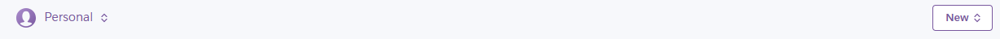

 <strong>Create app</strong>

 
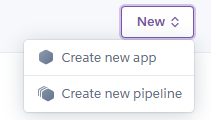

Give the app a project name, and choose the location you are in(Eu/US).

 <strong>Us/Eu</strong>

 
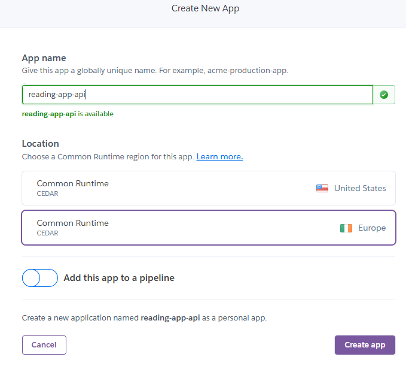

Then press **"Create app"**

### deploy heroku application

Navigate to **"Deploy"** section between the **"Resources"** and **"Metrics"**.

 <strong>Navigate to Deploy and adding github repository</strong>

 
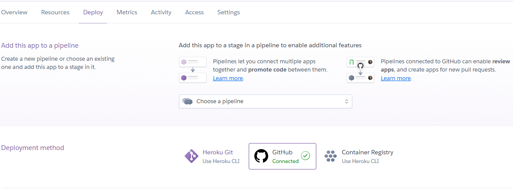

Go to **Deployment method** and choose the **Github** and connect to your Repository project.

Go down to **"Manual deploy"** section and press the **"Deploy Branch"**.

 <strong>Deploy Branch</strong>

 
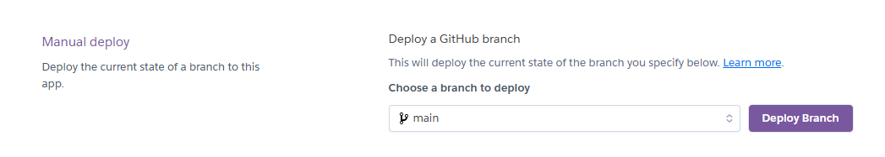

## Credits

### Help from websites.

- cloudinary.com for uploading pictures.
- https://www.pexels.com/ for pictures.
- https://www.geeksforgeeks.org
- how-to-setup-404-page-in-react-routing/ 404 page.
- https://stackoverflow.com/questions/3715047/
- how-to-reload-a-page-using-javascript
- code institute project for Django REST framework.
- and moments project from code institute for help with my React.
- https://www.w3schools.com/
- https://favicon.io/favicon-converter/ för favicon
- google font Crimson Text
- https://stackoverflow.com/questions/43692479/how-to-upload-an-image-in-react-js
- [cooler](https://coolors.co/) website for colors on the website.
  https://www.youtube.com/watch?v=IYCa1F-OWmk
- balsamiq for making wireframe.
- lucid.app for making my models.
- https://www.kindacode.com/article/react-removing-items-from-a-list#google_vignette
- https://developer.mozilla.org/en-US/docs/Web/API/File/name finding file Name
- https://github.com/testing-library/jest-dom/issues/202
- https://archive.jestjs.io/docs/en/22.x/mock-function-api#mockfnmockresolvedvaluevalue
- https://testing-library.com/docs/react-testing-library/intro/
- https://altcademy.com/blog/how-to-write-data-in-json-file-using-reactjs/
- https://www.freecodecamp.org/news/how-to-persist-a-logged-in-user-in-react/

## Acknowledgements

- and thanks my mentor Spence for help with guidance with my project.
