# Read & Review
This is Read and review a fullstack project. the  website is for people who enjoy reading and  who love to share and to get the thougths of recently read book and comment on them, or discover books that you have not read yet. you can post reviews on the website , and connect with others on the site!
its made with React  and django rest, and bootstrap.
[Read & Review here!](https://read-and-review-bdeebdc26c44.herokuapp.com/)
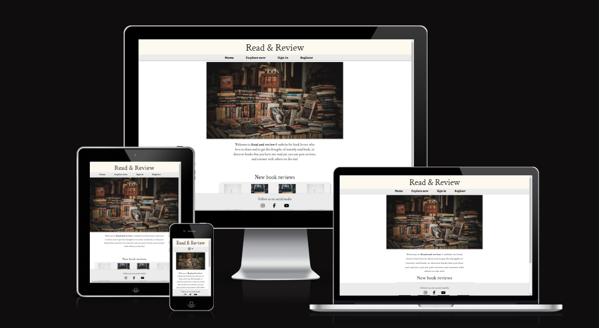

## Read & Review - - Table Content

 - [Planning the project](#Planning)
 - [Wireframes](#wireframes)
 - [Agile methodology](#Agile-methodology)
 - [Website Features](#Features)
 - [To be features](#to-be-features)
 - [backend](#django-rest)
 - [Installed Libraries](#installed-libraries)
 - [Technical Stack](#technical-stack)
 - [Testing](#testing)
 - [Validation](#validation)
 - [Testing in React](#react-test)
- [Bugs](#bugs)
- [Deployment](#Deployment)
- [Credits](#Credits)
- [Acknowledgements](#Acknowledgements)
 
 # Planning
 ### User stories om github

User story stack

 
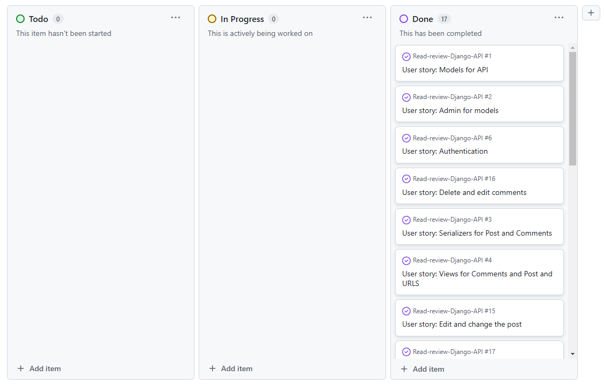

* Here is all the user storys made for this project. from the django rest back end to React front end planning.

[User story github](https://github.com/users/Timalexanderandersson/projects/11)

## Wireframes

Here is all the wireframe created for desktop and mobil format.
except for profiles. which is not included in this project yet.
and the rating system, since i did not have the time before deadline.

## Mobile
Here is the wirefram for mobile.
* here user can see new posts on the page and intro for the webpage.

Front page.

 
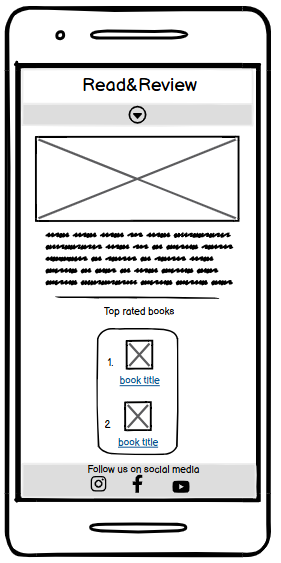

* sign in for user with password and username.

Sign in.

 
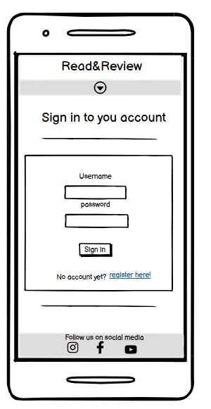

* Registration for user with input for password and username.

Registration.

 
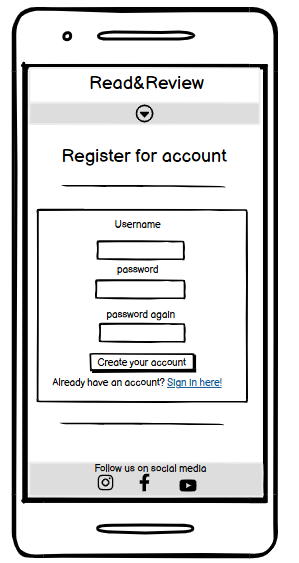

* inside post/sign in, user can comment on post, and delete, comment.

Inside post sign in.

 
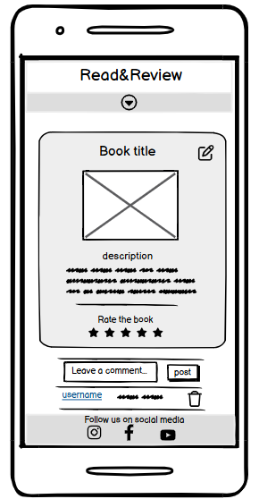

* visitor can not comment on the post.

Inside post logged out.

 
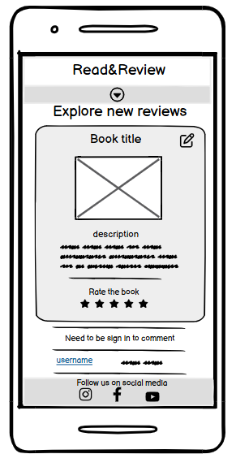

* here the visitor/user can find new uploaded posts.

explore-page.

 
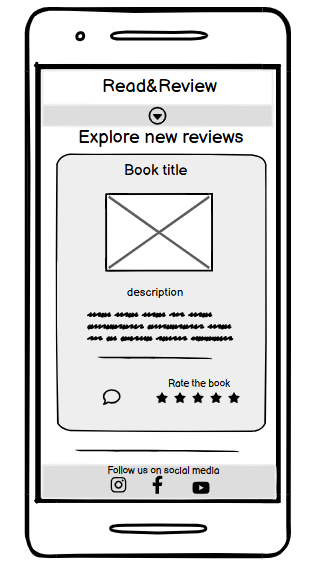

* user can edit the post.

Edit post.

 
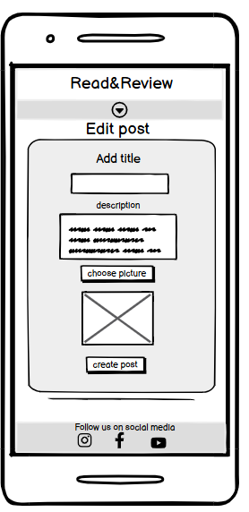

* user can post a review on to the website.

Add post

 
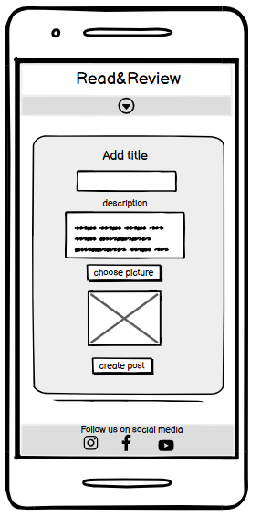

* Dropdown for user to find links in navigation field.

dropdown

 
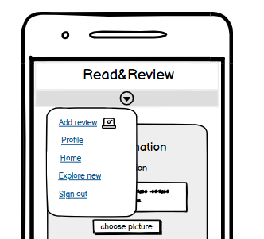

## Desktop 
* here user can see new posts on the page and intro for the webpage.

front page

 
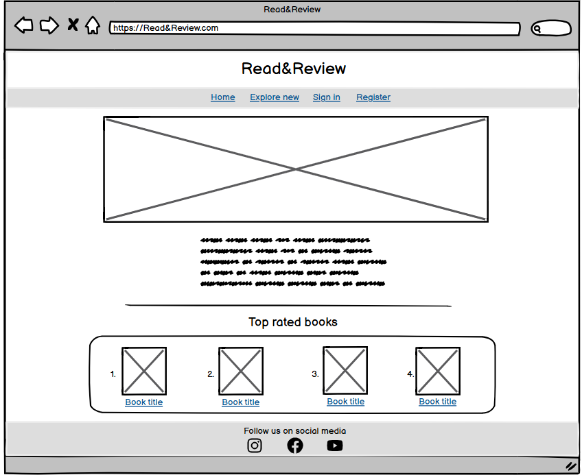

* here the visitor/user can find new uploaded posts.

explore-new

 
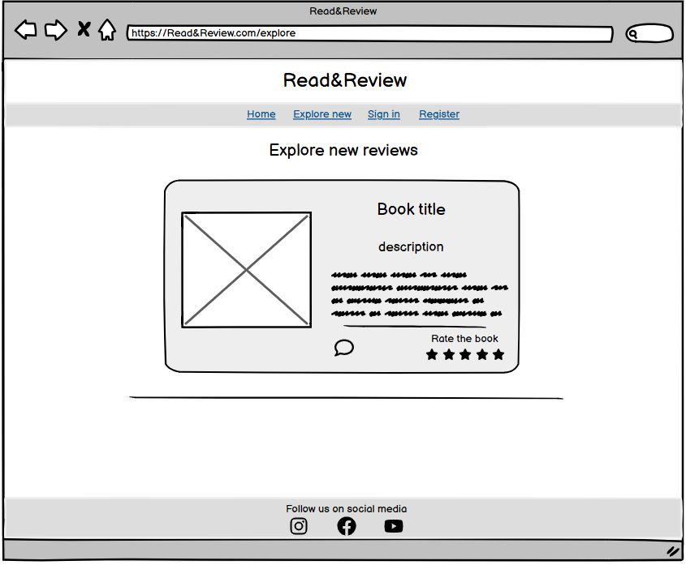

* user can post a review on to the website.

Add post

 
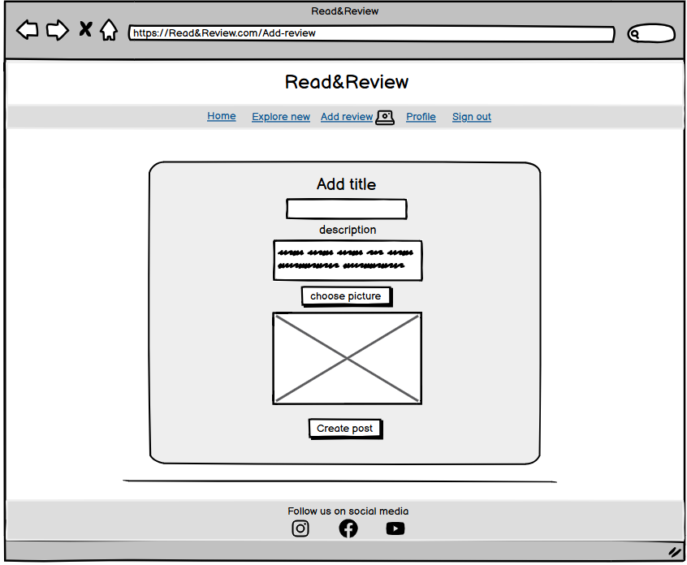

* user can edit the post.

Edit post

 
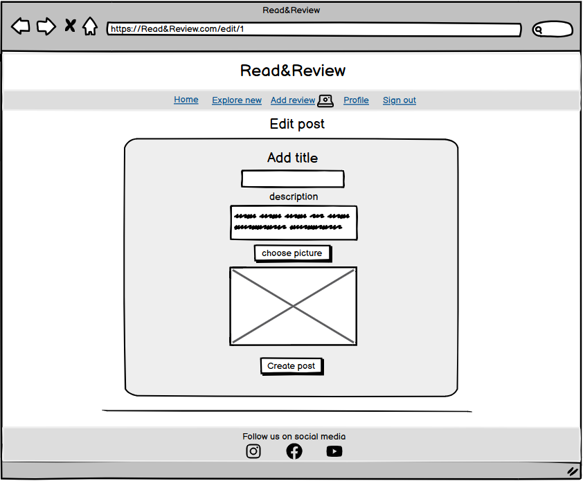

* sign in for user with password and username.

Sign in

 
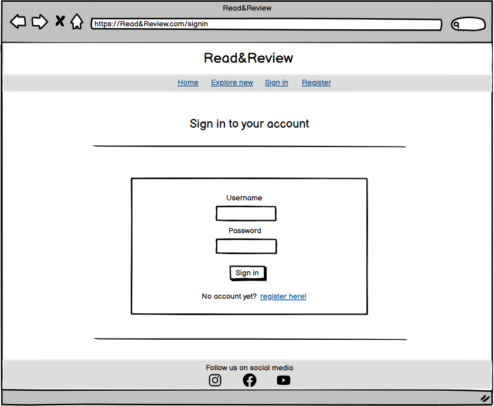

* Registration for user with input for password and username.

Registration

 

* inside post/sign in, user can comment on post, and delete, comment.

Inside post

 
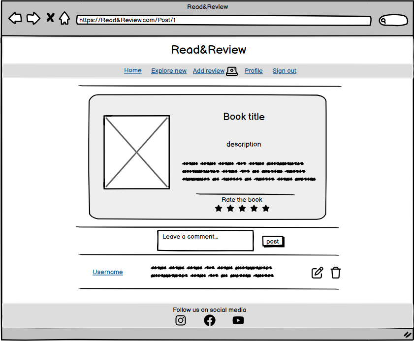

* visitor can not comment on the post.

post not sign in 

 
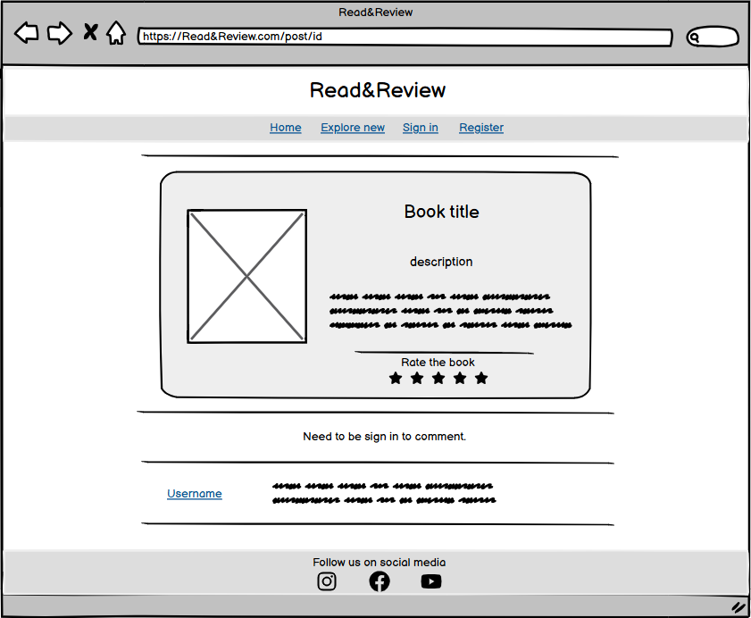

# Agile methodology
Was using Agile methodology while working on the project Read & Review. which worked good, following the user storys and checking them of one by one. making sure they was living up to acceptance criteria.

#### the 3 steps in the user story.

#### To Do
When the user story is created.
#### In Progress
When the user story is in progress to get done.
#### Done
When the user story is done.

### Diagram for models

Diagram models comment 

 
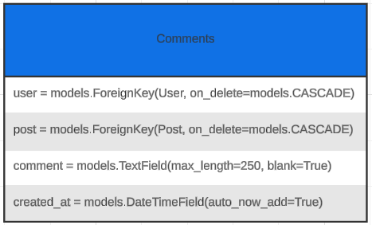

Diagram models post 

 
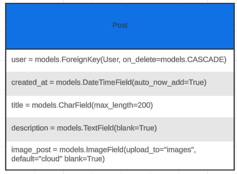

* lucid.app to create the diagrams

# Features

### navbar
* in the navbar if logged in(explore-page, add-review, signout, homepage )
* if sign out (sign in, explore-page, register, and homepage. )

navbar desktop

 
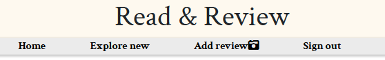

mobile navbar

 
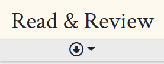

### Footer

* In the footer you have links and a text for following our pages on social media. (instagram, youtube, facebook)

footer mobil/desktop

 
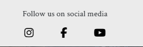

### frontpage
* frontpage include a list of 4 of the new add reviews posts. and short intro for the webpage.

frontpage desktop

 
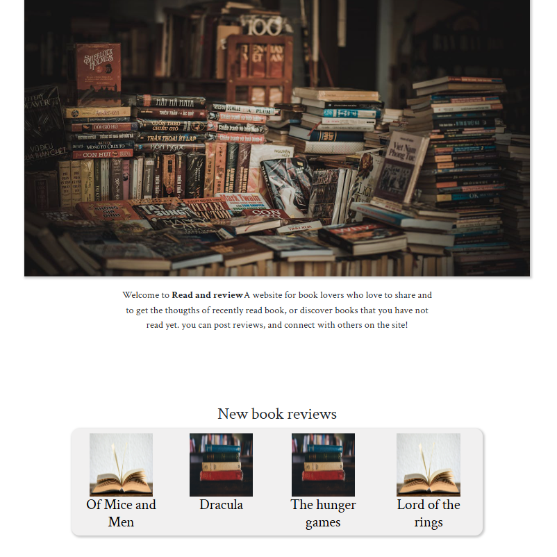

mobile frontpage

 
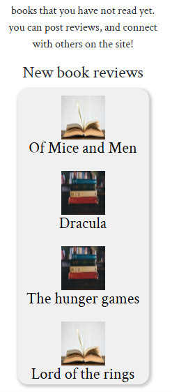

### add-review and edit.
* add-review includes (title, description, and image-upload, and button for creating the post)
* edit include the samethings and contains the information since created.

add review desktop/mobil

 
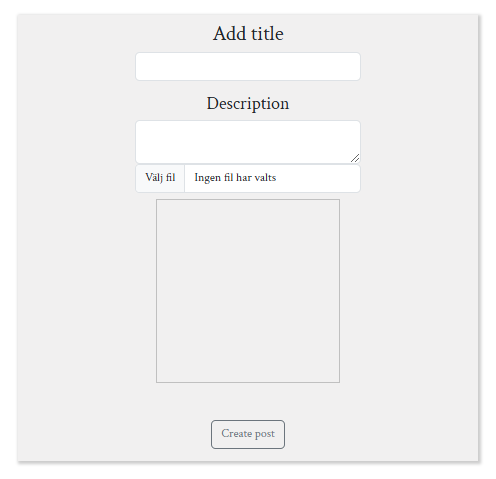

### posts page and comment.
* post shows all the information the user put out. and give users a comment section for commenting.

post desktop/mobil sign in

 
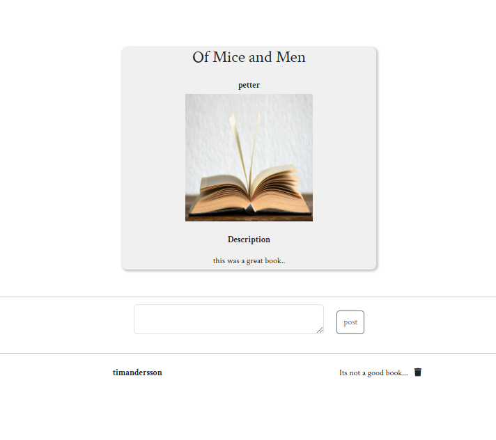

post desktop/mobil sign out

 
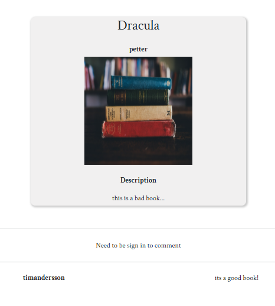

### explore page.
* contains all the new post with short description on all.

explore desktop/mobil 

 
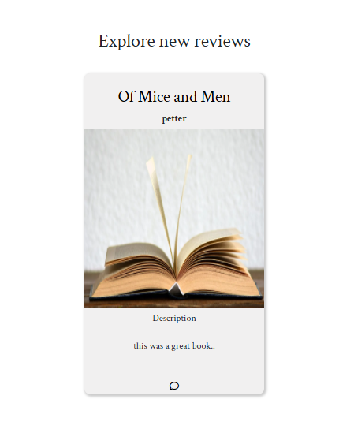

### Register.
* Register for user so they can get access to the website.

 desktop/mobil 

 
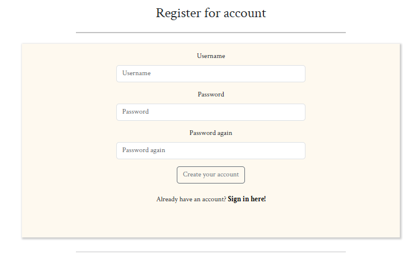

### Sign in.
* sign in for user who already have an account.

 desktop/mobil 

 
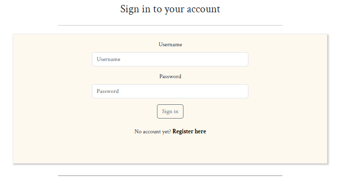

# To be features

* planning on making a profile page with an bio for information.
* and rating system with stars.
* and be able to comment on others comments.

# Django Rest backend
[Django rest API](https://github.com/Timalexanderandersson/Read-review-Django-API)

[heroku live](https://read-review-django-api-b8922a0fef0a.herokuapp.com/)

# Installed Libraries
asgiref==3.8.1
bcrypt==4.2.0
cloudinary==1.34.0
dj-database-url==0.5.0
dj-rest-auth==2.1.9
Django==4.2
django-allauth==0.50.0
django-cloudinary-storage==0.3.0
django-cors-headers==4.6.0
django-filter==24.3
djangorestframework==3.15.2
djangorestframework-simplejwt==5.3.1
gunicorn==23.0.0
oauthlib==3.2.2
pillow==11.0.0
psycopg2==2.9.10
PyJWT==2.10.0
python3-openid==3.2.0
pytz==2021.1
requests-oauthlib==2.0.0
sqlparse==0.5.2
urllib3==1.26.20

# Technical Stack
* Django REST: framework for creating API
* React: framework for frontend.
* CSS: style the site.
* Bootstrap.js: style the website.
* Python: back-end for django rest api.
* Gitpod: development
* Git: version control
* PostgreSQL: Database
* Lucidchart: models Diagram.
* Heroku: for deploying front-end and back-end.

# Testing

### Lighthouse

#### Desktop Lighthouse testing

Desktop results

 

#### Mobile Lighthouse

Mobile results

 

